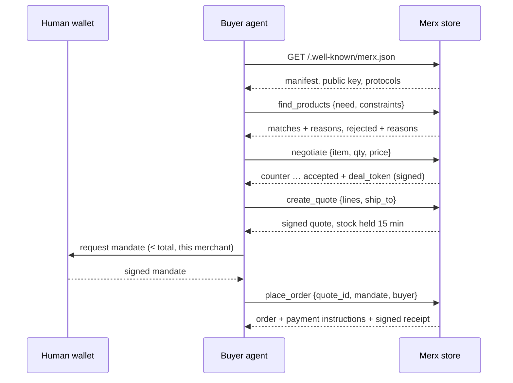

<p align="center">
  
</p>

<h1 align="center">Merx</h1>

<p align="center">
  <strong>The open-source store engine for customers who aren't human.</strong><br>
  Signed feeds · intent matching · policy negotiation · mandate-bound checkout · any agent protocol
</p>

<p align="center">
  <a href="https://github.com/kamilkubik89/merx/actions/workflows/ci.yml"></a>
  <a href="https://github.com/kamilkubik89/merx/actions/workflows/codeql.yml"></a>
  
  <a href="LICENSE"></a>
  
  
  
</p>

<p align="center">
  <a href="#quickstart">Quickstart</a> ·
  <a href="docs/SPEC.md">Spec</a> ·
  <a href="docs/ADAPTERS.md">Adapters</a> ·
  <a href="#status-and-roadmap">Roadmap</a> ·
  <a href="docs/README.sk.md">Slovensky</a>
</p>

---

Merx is a commerce engine for shops that sell only to AI agents. No theme, no cart page, no checkout button, no front end at all. A Merx store is a domain that answers one question well: *"Here is what my human needs — can you supply it, on what terms, and can you prove it?"*

```
$ curl https://tatra-coffee.example/
Tatra Coffee Roasters

This store has no website. It sells to software agents.
Start here: https://tatra-coffee.example/.well-known/merx.json
```

---

## Why

Protocols for agent commerce now exist: UCP for discovery and carts, ACP for checkout inside AI surfaces, AP2 for proving a human authorized the spend, MCP and A2A as transports, x402 for machine payments. They define **how agents talk to stores**.

Merx explores what the **store itself** can look like in that world. Traditional storefronts are designed around human browsing: product pages written as ads, displayed prices, coupon codes and policies in separate documents.

Merx starts from the other end. If the buyer is an agent, the product catalog should be designed for how agents decide:

| A human store optimizes for… | A Merx store optimizes for… |
|---|---|
| Persuasion (adjectives, urgency) | **Verifiable facts** with provenance |
| Browsing and discovery | **Intent matching** with reasons *and* rejections |
| A fixed price tag | **Negotiation as a published policy** |
| A checkout form | **Mandate-bound checkout** (the human's signed spending limit) |
| Trust via brand and design | **Cryptographic signatures** on feeds, offers, quotes, receipts |
| One integration per channel | **Protocol adapters** — speak MCP, A2A, REST, or plug in your own |

## Five ideas that make it different

**1. Facts, not copy.** Every attribute carries a `source` (`declared`, `measured`, `lab_test`, `certified`, `third_party`). Every claim ("organic", "fair trade") needs `evidence` or strict agents ignore it. A built-in linter scores your catalog for agent-readiness and flags marketing language:

```
$ npm run lint:catalog
Agent-readiness: 82/100
100  beans-ethiopia-guji-250
  1  mug-tatra
       error summary: marketing language agents ignore or distrust: best, amazing, premium quality, must-have.
       error claims.dishwasher_safe: claim without evidence will be hidden from strict agents
```

**2. `not_for` — radical honesty as a ranking signal.** Each product declares who should *not* buy it. An agent that learns a store is honest about fit will trust it more; a store that tries to sell a light-roast Ethiopian to someone who wants espresso loses the agent's trust across all future purchases. Merx makes that honesty a first-class field and the matcher penalises mismatches openly.

**3. Intent in, reasons out.** Agents don't browse. They send a need plus hard constraints and get ranked matches with *why*, and every rejected product with *why not*:

```json
{ "item_id": "grinder-hand-c40", "reasons": ["price 8900 > max 8000 (item is negotiable, try /negotiate)"] }
```

**4. Negotiation as policy, not a chatbot.** Merchants publish rules (volume and bundle discounts) and set a private floor per item. The engine concedes deterministically over a bounded number of rounds and returns a signed `deal_token`. Predictable for agents, auditable for merchants, never below the floor.

**5. Mandates and signed receipts.** An order is only accepted with a mandate signed by the human principal: spending limit, merchant scope, allowed categories, expiry, single-use nonce. The store returns a receipt signed with its key, a portable proof of purchase that any agent can verify. (Model inspired by AP2; an AP2 adapter is on the roadmap.)

## The flow



## Quickstart

Requires Node.js 22.6+. Zero runtime dependencies: TypeScript runs directly through Node's type stripping.

```bash
git clone https://github.com/kamilkubik89/merx && cd merx
npm install          # dev tooling only (typescript for typecheck)
npm run demo         # a scripted agent buys coffee end-to-end
npm start            # run the example store on :3000
npm test             # 34 unit + integration tests
npm run check        # what CI runs: typecheck, coverage gate, catalog lint
```

Then point any agent at it:

- **MCP** (Claude Desktop, IDE agents, any MCP client): `http://localhost:3000/mcp`
- **A2A**: agent card at `http://localhost:3000/.well-known/agent-card.json`
- **REST**: `http://localhost:3000/openapi.json`
- **LLM-friendly summary**: `http://localhost:3000/llms.txt`

Run your own store: write a `catalog.json` (see [`examples/stores/tatra-coffee`](examples/stores/tatra-coffee/catalog.json)), then

```bash
npm run merx -- lint my-catalog.json
MERX_CATALOG=my-catalog.json npm start
```

Useful env vars: `PORT`, `MERX_CATALOG`, `MERX_PRIVATE_KEY` or `MERX_KEY_FILE`, `MERX_WEBHOOK_URL` (receives `order.created`).

To test ordering by hand, create a test mandate with `npm run merx -- mandate --agent my-agent --max 15000 --merchants tatra-coffee`.

## Architecture

```
            ┌──────────── adapters (wire protocols) ─────────────┐
 agents ──▶ │  REST/OpenAPI   MCP   A2A   your-protocol.ts  …    │
            └──────────────┬─────────────────────────────────────┘
                           │ operations.ts (defined once, JSON Schema)
            ┌──────────────▼─────────────────────────────────────┐
            │ MerxEngine  feed · intent · negotiate · quote ·    │
            │             mandate · order · receipt · lint       │
            └──────────────┬─────────────────────────────────────┘
                           │ pluggable
          Scorer (lexical → embeddings) · PaymentProvider · catalog source
```

Every capability is defined once in [`src/adapters/operations.ts`](src/adapters/operations.ts) with a JSON Schema. MCP tools, A2A skills and the OpenAPI document are generated from that list, so adding an operation makes it available in every protocol. Writing an adapter for a new protocol is a single file: see [`docs/ADAPTERS.md`](docs/ADAPTERS.md).

## Specification

The feed format, mandate and receipt formats are documented in [`docs/SPEC.md`](docs/SPEC.md) (Merx 0.1, draft). Short version of one feed item:

```json
{
  "id": "beans-brazil-cerrado-1kg",
  "gtin": "8580000000028",
  "title": "Brazil Cerrado, whole bean, 1 kg",
  "summary": "Medium-dark roast, pulped natural. Cup notes: milk chocolate, hazelnut. Low acidity...",
  "category": ["coffee", "beans"],
  "attributes": [
    { "key": "net_weight", "value": 1000, "unit": "g", "source": "measured" },
    { "key": "acidity_level", "value": 1, "source": "declared", "note": "1 (low) to 5 (high)" }
  ],
  "claims": [{ "id": "rainforest_alliance", "statement": "Rainforest Alliance certified farm",
               "evidence": { "type": "certificate", "issuer": "Rainforest Alliance", "ref": "RA-C-0000000" } }],
  "best_for": ["espresso", "milk drinks", "low acidity"],
  "not_for": ["light roast", "fruity"],
  "offer": {
    "price": { "amount": 3290, "currency": "EUR" },
    "compare_basis": { "per": "kg", "amount": 3290 },
    "availability": { "in_stock": true, "quantity": 38, "lead_time_days": 1 },
    "negotiable": true,
    "valid_until": "2026-09-22T20:30:00.000Z"
  },
  "content_hash": "4f1c…",
  "updated_at": "2026-09-22T20:15:00.000Z"
}
```

## Status and roadmap

Merx 0.1 is a working reference implementation and a draft spec, not production software. Storage is in-memory, and the example payment provider only returns bank-transfer instructions.

Roadmap, and good first contributions:

- **Adapters:** UCP (`/.well-known/ucp`), ACP checkout, AP2 mandate verification, x402
- **Catalog sources:** import from Shopify / WooCommerce / Google Merchant feeds, with an automatic "de-marketing" pass
- **Storage:** SQLite and Postgres adapters for orders, holds and sessions
- **Payments:** Stripe, GoPay, Adyen, stablecoin rails
- **Matching:** embedding scorer, cross-store comparison agent
- **Trust:** portable reputation from signed receipts (agents share verified purchase outcomes), `did:web` store identity
- **Post-purchase:** machine-readable returns and warranty claims

## Quality

Every push and pull request runs on GitHub Actions against Node 22 and 24: typecheck, 34 unit and HTTP integration tests covering all three protocols, a coverage gate (≥ 90 % lines, currently ~98 %), an agent-readiness check of the example catalog, the end-to-end buyer-agent demo, and a Docker build with smoke test. CodeQL scans the code weekly. Tagging `v*` publishes a GitHub release.

## Contributing

Issues and PRs are welcome: see [CONTRIBUTING.md](CONTRIBUTING.md), the [code of conduct](CODE_OF_CONDUCT.md) and the [security policy](SECURITY.md). Adapter proposals have their own issue template.

## License

[MIT](LICENSE) © [Kamil Kubík](https://github.com/kamilkubik89)
